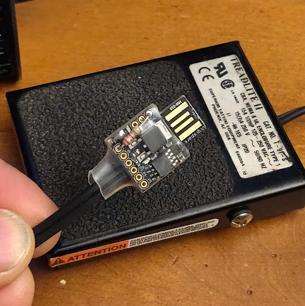

# digispark-usb-kbd

This program is for the Digispark (ATTiny85 MCU) USB board. This acts like 
a USB keyboard and presses ENTER whenever P0 is pulled to GND.

This is useful, for example, to start an MCU programmer while you hold the
spring connector onto the board to be programmed.

## Setup Arduino for Digispark

In Arduino IDE, do *File/Preferences* and in the field *Additional Boards Manager*
enter:

>`http://digistump.com/package_digistump_index.json`

In the *Tools* menu, click *Boards* and *Boards Manager* and find the *Digistump AVR Boards*
and click *Install*.

Once finished, in the *Tools* menu choose *Digispark (Default 16.5 MHz)*.

## Program

Double-click the *digispark-usb-kbd.ino* program to bring up the Arduino IDE.
Build and upload the program and then attach the Digispark board to begin 
programming the board.

## Notes

1. There is a 5 second delay when the Digispark board is first attached. The bootloader
waits for any programming. After 5 seconds it will run the user program.

1. I added a 2.2k resistor to pull pin P0 to 5V. Without this resistor, it only has
the weak pullup of the MCU and may false trigger from random electrical noise.
